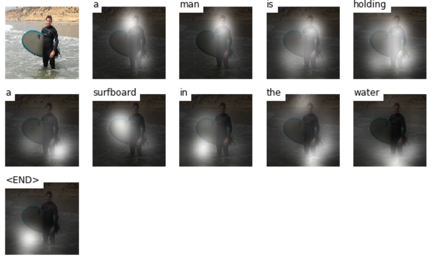
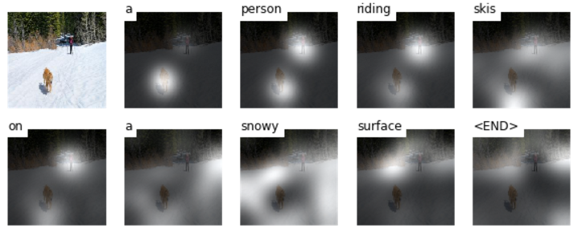
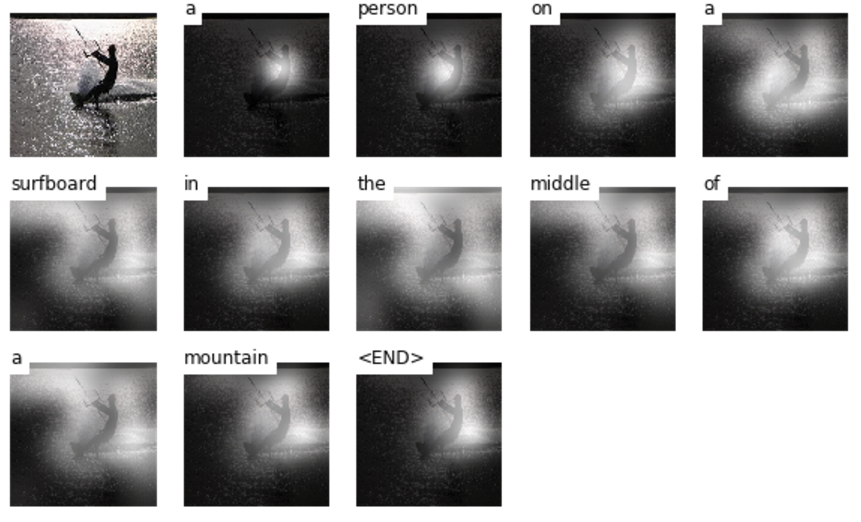

# Attention Based Image Caption Generator
implementation of "Show, Attend and Tell": http://arxiv.org/abs/1502.03044

## Reference
author's source code : https://github.com/kelvinxu/arctic-captions

another tensorflow implementation : https://github.com/jazzsaxmafia/show_attend_and_tell.tensorflow

## Visualization Results
###1. Training Data

###2. Validation data

###3. Test data

