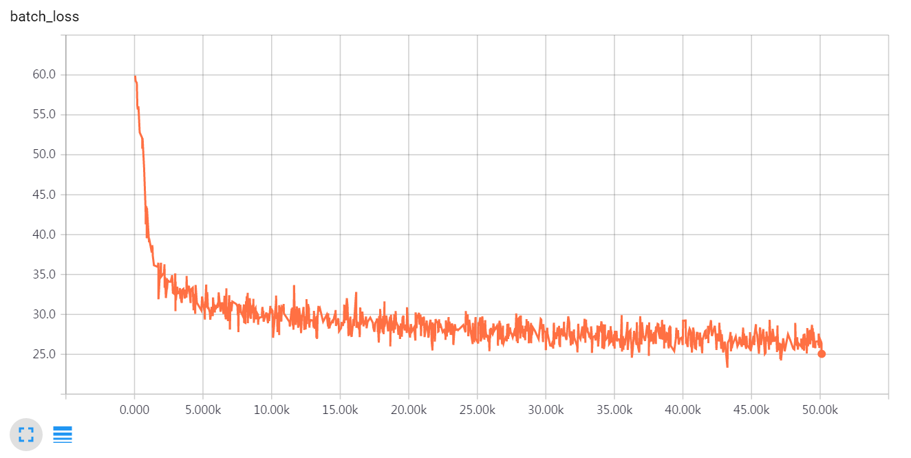
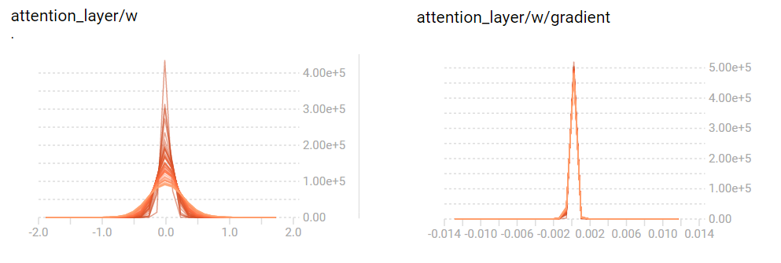
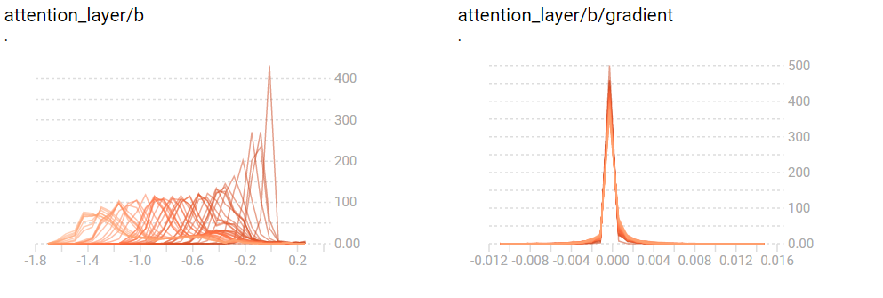
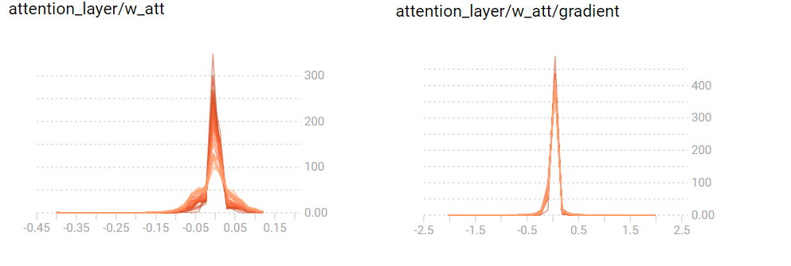

# Show, Attend and Tell 
TensorFlow implementation of [Show, Attend and Tell: Neural Image Caption Generation with Visual Attention] (http://arxiv.org/abs/1502.03044) which introduces an attention based image caption generator. The model can automatically learn to fix its gaze on salient objects while generating the corresponding words in the output seqeunce.


<br/>

## References
The referenced author's theano code can be found [here] (https://github.com/kelvinxu/arctic-captions).

This repo is an upgraded version of the existing tensorflow implementation. You can find it [here] (https://github.com/jazzsaxmafia/show_attend_and_tell.tensorflow).

<br/>


## Getting Started

#### Prerequisites 

This code is written in Python2.7 and requires [TensorFlow](https://www.tensorflow.org/versions/r0.11/get_started/os_setup.html#anaconda-installation). If you're on Ubuntu, installing TensorFlow using [Anaconda](https://www.continuum.io/downloads) may look something like: 

For cpu version, 

```bash
$ source anaconda2/bin/activate ~/anaconda2/
$ export TF_BINARY_URL=https://storage.googleapis.com/tensorflow/linux/cpu/tensorflow-0.11.0rc1-cp27-none-linux_x86_64.whl
$ pip install --ignore-installed --upgrade $TF_BINARY_URL
```

For gpu version,
 
```bash
$ source anaconda2/bin/activate ~/anaconda2/
$ export TF_BINARY_URL=https://storage.googleapis.com/tensorflow/linux/gpu/tensorflow-0.11.0rc0-cp27-none-linux_x86_64.whl
$ pip install --ignore-installed --upgrade $TF_BINARY_URL
```

In addition, we need to install a few more packages (e.g. hickle, scikit-image) for processing dataset.
To install the required python packages, run:

```bash
$ pip install -r requirements
```

For evaluation with BLEU metic, we need to clone [pycocoevalcap](http://mscoco.org/dataset/#download).

```bash
$ git clone https://github.com/tylin/coco-caption.git
```

#### Preparing the training data

A script is provided to download the MSCOCO image data and [imagenet-vgg-verydeep-19.mat](http://www.vlfeat.org/matconvnet/pretrained/). Downloading the data may take several hours depending on the network speed. Run code below then the image data will be downloaded in the image directory and mat file will be downloaded in the data directory.

```bash
$ git clone https://github.com/yunjey/show-attend-and-tell-tensorflow.git
$ cd show-attend-and-tell
$ chmod +x ./download.sh
$ ./download.sh
```


For feeding the image to VGGNet, we should resize the MSCOCO image data set into fixed size of 224x224. Run code below then train2014_resized and val2014_resized will be created in the image folder.

```bash
$ python resize.py
```

Before training the model, we have to preprocess the MSCOCO data set to generate `captions.pkl` and `features.hkl`. `captions.pkl` is a numpy array in which each row contains a list of word indices. Also, `features.hkl` is a numpy array which contains activation maps extracted from conv5_3 layer of VGGNet. 
To generate `captions.pkl` and `features.pkl`, run :

```bash
$ python prepro.py --batch_size=50 --max_length=15 --word_count_threshold=3
```

#### Train the model

```bash
$ python train.py --batch_size=64 --epoch=15 --lr=0.001 --model_path='./model/lstm' --log_path='./log' 
```

#### Tensorboard visualization

```bash
$ tensorboard --logdir='./log' --port=6005

Then open http://0.0.0.0:6005/ into your web browser
```

<br/>

## Results
Below are visualizations for the attention model.

If you want to get more details, see `evaluate_model.ipynb`. 

<br/>

####Training data

#####(1) Generated caption: A plane flying in the sky with a landing gear down.


#####(2) Generated caption: A giraffe and two zebra standing in the field.


####Validation data

#####(1) Generated caption: A large elephant standing in a dry grass field.


#####(2) Generated caption: A baby elephant standing on top of a dirt field.


####Test data

#####(1) Generated caption: A plane flying over a body of water.


#####(2) Generated caption: A zebra standing in the grass near a tree.


## Training Details 








